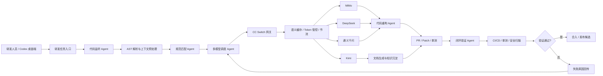

# 架构与核心链路

## 总体架构

系统把 Codex 桌面端作为研发人员的主要交互入口，把 CC Switch 作为模型网关、缓存管控、路由调度和用量治理层。各类 Agent 不直接绑定单一模型，而是通过 CC Switch 获得统一模型能力、统一请求格式、统一用量统计和统一缓存策略。

## 关键模块

| 模块 | 职责 | 输出 |
| --- | --- | --- |
| Codex 入口 | 承接研发人员任务、交互式补充上下文、触发 Agent 流程 | 标准化研发任务 |
| CC Switch 网关 | 多模型 Provider 管理、模型切换、请求路由、缓存与统计 | 可治理的大模型调用能力 |
| 语义缓存层 | 对重复或近似请求做语义归一、命中复用、降低重复 Token | 缓存命中结果与节流策略 |
| Agent 编排层 | 将需求拆解为扫描、匹配、调度、重构、验证等子任务 | 长链推理计划和执行结果 |
| 验证层 | 连接测试、安全扫描、CI/CD 和 PR 流程 | 可合入或需迭代的判定 |

## 数据流

1. 研发人员在 Codex 中提出代码生成、重构、评审或文档任务。
2. 代码监听 Agent 拉取仓库上下文，生成结构化代码摘要。
3. 规范匹配 Agent 结合公司规范、安全规则和历史问题库生成任务清单。
4. 多模型调度 Agent 根据任务类型、上下文长度、成本预算和缓存命中情况选择模型。
5. CC Switch 对请求进行路由、缓存、Token 统计和节流。
6. 代码重构 Agent 生成 Patch、单测、文档和 PR 描述。
7. 闭环验证 Agent 触发 CI/CD，失败结果回传调度层继续迭代。

## 缓存策略

缓存设计采用分层思路，目标是把重复语义请求从“再次完整推理”转为“可复用上下文和结果”：

- Prompt 归一：对重复代码评审、规范查询、测试模板生成进行结构化归一。
- 语义向量命中：对同类问题、相似代码片段和相同规范项进行近似匹配。
- 任务级结果缓存：缓存可复用的重构建议、测试策略、规范解释和文档摘要。
- 模型无关复用：把缓存结果放在 CC Switch 网关层，减少跨模型重复消耗。
- 命中回填：验证后的有效结果进入高置信缓存，失败样本进入负样本池。

## 治理能力

- Token 预算：按团队、项目、任务类型和模型维度统计。
- 路由策略：按代码重构、长文档、单测、日常交互等任务选择模型。
- 失败回退：模型超时、格式不兼容或验证失败时切换备用模型。
- 审计留痕：保留任务摘要、模型选择、Token 消耗、缓存命中和验证结果。
- 权限边界：把私有仓库代码、密钥和内部规范限制在企业环境内处理。
